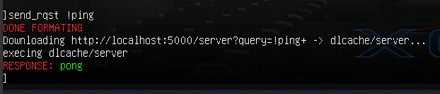
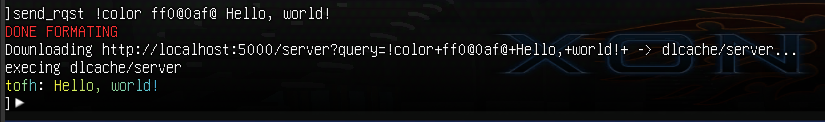

# Xonotic-Chat-Server

This project is inspired by Shazza-works' amazing [xonotic_color](https://github.com/shazza-works/xonotic_colour) project.

## Setup instructions

>This project has been tested on python 3.11.3.

Clone this repository to your local machine:
```
git clone https://github.com/DetectiveJian/xonotic-chat-server.git
```

Move into the repo directory:
```
cd xonotic-chat-server
```

Setup a python virtual environment:
```
python -m venv .venv
```

Activate the python venv:
```
source .venv/bin/activate
```
>To deactivate the virtual environment run `deactivate`

Upgrade pip & install the wheel package:
```
pip install --upgrade pip wheel
```

Now install the required packages:
```
pip install -r requirements.txt
```

Move the `client-config.cfg`, `user-config.cfg` & `xcsutils.cfg` to your xonotic [userdir](https://xonotic.org/faq/#what-is-the-difference-between-the-config-and-install-directories) `~/.xonotic/data/`

A much better approach is to create symlink of `client-config.cfg`, `user-config.cfg` & `xcsutils.cfg` in your xonotic [userdir](https://xonotic.org/faq/#what-is-the-difference-between-the-config-and-install-directories) `~/.xonotic/data/`:
```
ln -sf $(pwd)/*.cfg ~/.xonotic/data/
```
>Note: you'll have to run the `client-config.cfg` script manually from xonotic's console, each time you launch xonotic

To execute `client-config.cfg` script automatically, each time xonotic is launched, add the following lines to your `autoexec.cfg` file:
```
defer 2 "if_client \"setup_client\""
alias setup_client "exec client-config.cfg"
```

### Starting the server
The server can be ran by:

```
python server.py
```

>The server will be listening at `http://127.0.0.1:500/server` for queries.

# Usage
`client-config.cfg` provides `send_rqst` function to send queries to the server and also listens for the responce.

General case:
```
send_rqst <cmd> <data>
```

### Ping
Client:
```
send_rqst !ping
```



### Color
SYNTAX: `send_rqst !color start@stop@ <text>` adds color from `start` to `stop`, to the text provided.

Client:
```
send_rqst !color ff0@0af@ Hello, wolrd!
```
Server adds colors starting from `ff0` to `0af`, to the text


These colors are calculated using [linear interpolation](https://en.wikipedia.org/wiki/Linear_interpolation), also known as lerp. Visualization of the color codes in above example:


an indepth dive into [lerp](https://youtu.be/YJB1QnEmlTs).

### Help
Prints help message to xonotic's console.
```
send_rqst !help
```
### Random
Random colored chat
```
send_rqst !random <text>
```
### Rainbow
Rainbow colored chat
```
send_rqst !rainbow <text>
```

>I'd encourage you to add your own features!, as this project is intended to be a base template for others to build on.

# Keybindings

`client-config.cfg` has a few binds by default:
```
bind p "commmadmode send_rqst" // key p is bound to directly access the send_rqst function to send any query.
bind o "commandmode send_rqst !random" // key o for random color encoding.
```
You can add more keybindings yourself in `user-config.cfg`.

